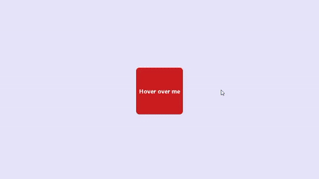

# simple-react-tooltip
A simple light weight react package to display components as tooltip over other components

## How to use it
Just wrap your component and pass the tooltip you wish to use
```javascript
<SimpleReactTooltip tooltip={TooltipComp}>
    <Child />
</SimpleReactTooltip>
```

## Example
```javascript
import React from 'react';
import './App.css';
import SimpleReactTooltip from 'SimpleReactTooltip';

const Child = () => {
  return(
    <div className={'child'}>
      <p>Hover over me</p>
    </div>
  )
}

function App() {

  const TooltipComp =  <div className={'tooltip'}>
    <p>I'm a tooltip</p>
  </div>

  return (
    <div className="App">
      <SimpleReactTooltip tooltip={TooltipComp}>
        <Child />
      </SimpleReactTooltip>
      
    </div>
  );
}

export default App;

```

## Result
